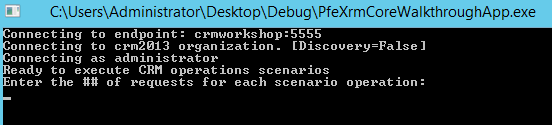
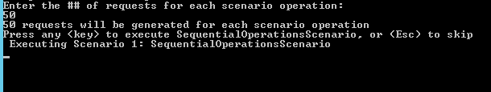
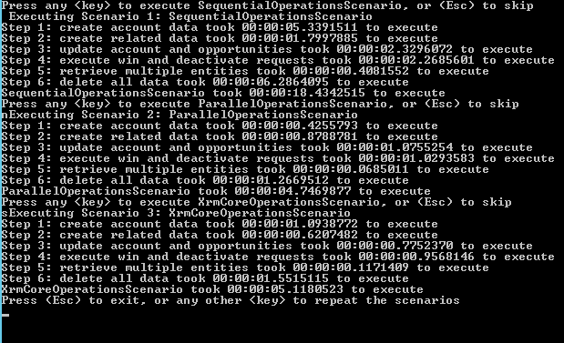

#### Sample Solution: PfeXrmCoreWalkthroughApp

We've provided a fully functional console app to demonstrate how the PFE Core Library for Dynamics CRM can be incorporated into a real-world application.  The app provides patterns for connecting to CRM and executing many common request types as parallelized operations.  Below are details on how the app is structured.  

_If you're just interested in how to run the app, skip ahead to the [instructions](#How-to-run-PfeXrmCoreWalkthroughApp)._

**Connecting to CRM**

[ServiceManagerContext.cs](/Samples/PfeXrmCoreWalkthroughApp/ServiceManagerContext.cs) demonstrates a singleton object that provides an application-wide shared reference to a Discovery/OrganizationServiceManager instance targeting the specified CRM deployment.  This approach is useful when authenticating as a single identity and/or impersonating CRM users.

**Scenarios**

There are three scenario classes that perform a sequence of operational steps.  Each scenario class presents a unique pattern to contrast performance and syntactic characteristics.  Scenarios include:

* [SequentialOperationsScenario.cs](/Samples/PfeXrmCoreWalkthroughApp/Scenarios/SequentialOperationsScenario.cs) - Performs standard, sequential operations using available API's in the CRM SDK
* [ParallelOperationsScenario.cs](/Samples/PfeXrmCoreWalkthroughApp/Scenarios/ParallelOperationsScenario.cs) - Performs parallelized operations using available API's in the CRM SDK within a typical .NET Task Parallel Library (TPL) implementation
* [XrmCoreOperationsScenario.cs](/Samples/PfeXrmCoreWalkthroughApp/Scenarios/XrmCoreOperationsScenario.cs) - Performs parallelize operations using PFE Core Library for Dynamics CRM
**Steps**

The logic flow for each scenario involves the following steps:

* Step 1: Create a list of Accounts
* Step 2: Create a list of related Contacts and Opportunities
* Step 3: Update a list of Accounts and Opportunities
* Step 4: Execute a list WinOpportunityRequests and SetStateRequests
* Step 5: RetrieveMultiple for a list of Queries (Account, Contact, and Opportunity)
* Step 6: Delete a list of Accounts (cascades to Contacts and Opportunities)
[Requests.cs](/Samples/PfeXrmCoreWalkthroughApp/Requests.cs) defines the sets of organization requests that are issued in each scenario step above.  If all steps execute successfully, no data should be left in the targeted CRM organization.

##How to run PfeXrmCoreWalkthroughApp##

* Download the PfeXrmCoreWalkthroughApp Source Code
* Update the following settings in the [App.Config](/Samples/PfeXrmCoreWalkthroughApp/App.config) file to target your CRM deployment.  While this application uses the CRM 2016 version of our library and SDK assemblies, you can theoretically target earlier versions with this application.  
```xml
  <appSettings>
    <add key="Crm.Username" value="administrator"/>
    <add key="Crm.Password" value="password"/>
    <add key="Crm.EncryptedPassword" value=""/>
    <add key="Crm.DiscoveryHost" value="https://SERVER:5555"/>
    <add key="Crm.Organization" value="ORGANIZATION" />
    <add key="Crm.OrganizationHost" value="https://SERVER:5555/ORGANIZATION"/>
    <add key="Crm.ShouldDiscover" value="False"/>
  </appSettings>
```

* Be sure to leave the **Crm.EncryptedPassword** setting blank because this value will be populated with an encrypted version of the plain text password using our security extensions upon first execution of the app (see [SamplesConfig.cs](/Samples/PfeXrmCoreWalkthroughApp/SamplesConfig.cs)).  Below is an example of config settings after the password has been stored as encrypted value.
```xml
  <appSettings>
    <add key="Crm.Username" value="administrator" />
    <add key="Crm.Password" value="" />
    <add key="Crm.EncryptedPassword" value="AQAAANCMnd8BFdERjHoAwE/Cl+sBAAAAU0J/rBbyu0+sz/UzyqkoCwAAAAACAAAAAAADZgAAwAAAABAAAACNFNphm3TRV5zOwWvYCGRLAAAAAASAAACgAAAAEAAAAC9wnrBAtDhq7xHOm8tWlPwYAAAAaJmHs57GOqcGRABxgKvRS/asEmTekR3+FAAAAI7LKJEZOdtzXx2xU7AefWI77SzI" />
    <add key="Crm.DiscoveryHost" value="https://SERVER:5555"/>
    <add key="Crm.Organization" value="ORGANIZATION" />
    <add key="Crm.OrganizationHost" value="https://SERVER:5555/ORGANIZATION"/>
    <add key="Crm.ShouldDiscover" value="False"/>
  </appSettings>
``` 

* Build and run the application.  In the console window you will see the connection settings and be prompted to enter the number of requests that should be issued in each step. 


* Enter any whole number and press **Enter**.  You will then be prompted to execute or skip each of the three scenarios in sequence. 


* If you wish to execute the current scenario, press any **key**, otherwise press **Esc** to skip that scenario.  Each step within the current scenario will display a duration statistic after completing execution.


*  When all steps have been performed, you will be prompted to execute (or skip) the next scenario.  After completion of (or skipping) all three scenarios, you will again be prompted to exit the application **Esc** or press any **key** to repeat the scenarios.

Please refer to the [known issues](known-issues.md) page if any unexpected exceptions are encountered.